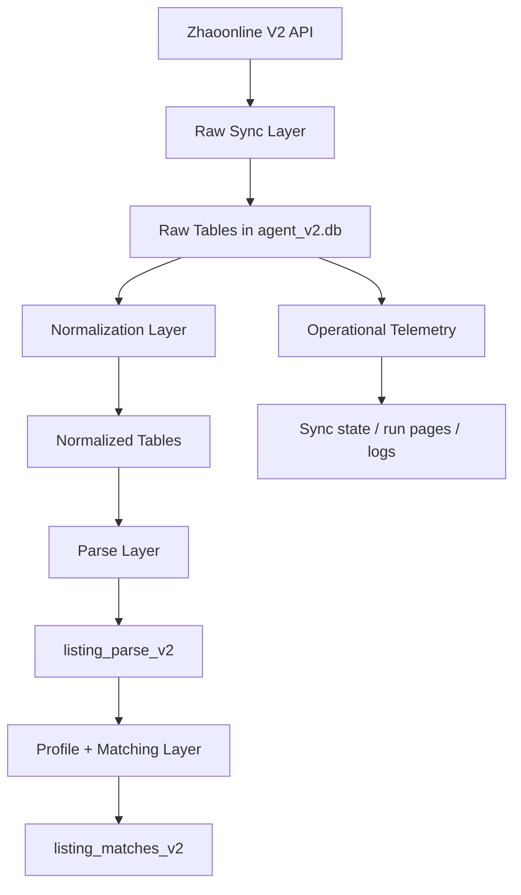

# V2 Architecture

## Purpose

V2 exists because the new Zhaoonline API changed both the data shape and the sync model.

Compared with V1:
- payloads are richer
- incremental sync is window-based
- the database needed a new raw/normalized design
- matching now needs to work from a real interest model instead of only `user_items`

## High-Level Layers

## Main V2 Code Areas

### API / Auth

- `src/ai_agent_v2/clients/zhaoonline.py`

Responsibilities:
- build `X-Auth-Timestamp`
- build `MD5(secret + timestamp)`
- call the V2 incremental endpoint

### Live Incremental Sync

- `src/ai_agent_v2/ingestion/live_incremental.py`
- `scripts_v2/orchestration/run_v2_incremental_cycle.py`
- `scripts_v2/windows/run_v2_incremental_cycle.ps1`
- `scripts_v2/windows/register_v2_incremental_task.ps1`

Responsibilities:
- maintain a separate live watermark under `source_platform='zhaoonline_live'`
- fetch one completed time window per run
- write meaningful raw change rows
- avoid overlapping runs via a lock file

### Storage / Schema Bootstrap

- `src/ai_agent_v2/storage/sqlite_store.py`
- `migrations_v2/*.sql`

Responsibilities:
- create V2 tables if missing
- apply SQL migrations in order

### Parsing

- `src/ai_agent_v2/parsing/listing_parser.py`

Responsibilities:
- classify listings into `stamp_like`, `coin_like`, `art_like`, `other`
- extract identity / series / variant / condition keys
- normalize `J`/`纪`, `T`/`特` style stamp aliases

### Matching

- `src/ai_agent_v2/matching/v2_matcher.py`
- `scripts_v2/matching/run_zhaoonline_v2_matching.py`

Responsibilities:
- read parsed listings
- read V2 profile targets first, legacy `user_items` second
- score `exact_identity`, `variant_related`, `series_related`
- write active/inactive matches into `listing_matches_v2`

### Profile / Demo Seed

- `src/ai_agent_v2/profile/user_profile_migration.py`
- `src/ai_agent_v2/profile/demo_user_seed.py`
- `scripts_v2/orchestration/migrate_v2_interest_profile.py`
- `scripts_v2/orchestration/seed_v2_demo_user.py`

Responsibilities:
- migrate legacy profile data into the V2 interest model
- seed a curated demo user for matching evaluation

### Reporting

- `src/ai_agent_v2/reporting/match_audit.py`
- `scripts_v2/reporting/run_zhaoonline_v2_match_audit.py`

Responsibilities:
- summarize current active V2 matches
- help developers review matching quality

## Data Flow

### Live Polling Flow

1. Windows Task Scheduler runs `run_v2_incremental_cycle.ps1`
2. PowerShell wrapper calls `run_v2_incremental_cycle.py`
3. Python runner reads secret from env or `data/secrets/zhaoonline_secret.txt`
4. Runner locks `data/locks/zhaoonline_v2_incremental_live.lock`
5. Sync fetches one completed hour window using the V2 incremental endpoint
6. Meaningful rows are stored in raw V2 tables
7. `zhao_v2_sync_state` is updated for `zhaoonline_live`

### Matching Flow

1. Seed or migrate a profile into `user_interests_v2` and `user_interest_targets_v2`
2. Parse listings into `listing_parse_v2`
3. Run `run_zhaoonline_v2_matching.py`
4. Matcher reads V2 targets and candidate listings
5. Matches are written into `listing_matches_v2`
6. Audit report summarizes current active matches

## Current Architectural Boundaries

### Stable Enough

- V2 database bootstrap
- V2 profile model
- V2 live incremental scheduler
- V2 parsing
- V2 matching

### Still Transitional

- automatic downstream processing after scheduled incremental polling
- signal generation
- end-user delivery/reporting on top of V2
- a fully checked-in V2 normalization runner path

## Important Design Decision

The scheduled live forward sync intentionally uses:
- `source_platform='zhaoonline_live'`

This keeps it separate from:
- older historical backfill state under `source_platform='zhaoonline'`

That separation prevents the scheduler from replaying historical backfill windows during daily operation.
