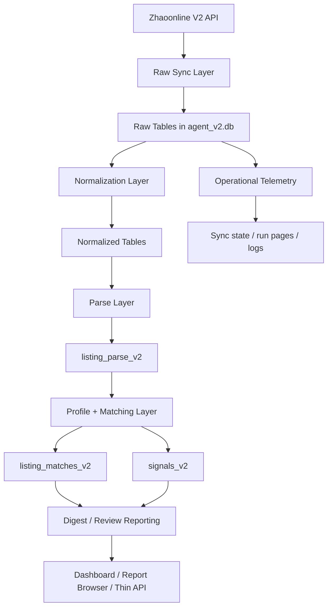

# V2 Architecture

## Purpose

V2 exists because the new Zhaoonline API changed both the data shape and the sync model.

Compared with V1:

- payloads are richer
- incremental sync is window-based
- the database needed a new raw/normalized design
- matching now works from a real interest model instead of only `user_items`
- the current live product shell is built around reports, signals, and interest-driven monitoring

## High-Level Layers

## Main V2 Code Areas

### API / Auth

- `src/ai_agent_v2/clients/zhaoonline.py`

Responsibilities:

- build `X-Auth-Timestamp`
- build `MD5(secret + timestamp)`
- call the V2 incremental endpoint

### Live Incremental Sync

- `src/ai_agent_v2/ingestion/live_incremental.py`
- `scripts_v2/orchestration/run_v2_incremental_cycle.py`

Responsibilities:

- maintain a separate live watermark under `source_platform='zhaoonline_live'`
- fetch one completed time window per run
- write meaningful raw change rows
- avoid overlapping runs via a lock file

### Storage / Schema Bootstrap

- `src/ai_agent_v2/storage/sqlite_store.py`
- `migrations_v2/*.sql`

Responsibilities:

- create V2 tables if missing
- apply SQL migrations in order
- keep the current runtime SQLite-first

### Parsing

- `src/ai_agent_v2/parsing/listing_parser.py`

Responsibilities:

- classify listings into `stamp_like`, `coin_like`, `art_like`, `other`
- extract identity / series / variant / condition keys
- normalize stamp and coin title variants into comparable keys

### Matching

- `src/ai_agent_v2/matching/v2_matcher.py`
- `scripts_v2/matching/run_zhaoonline_v2_matching.py`

Responsibilities:

- read parsed listings
- read V2 profile targets first, legacy `user_items` second
- score `exact_identity`, `variant_related`, `series_related`
- write active/inactive matches into `listing_matches_v2`

### Signals

- `src/ai_agent_v2/signals/interest_signals.py`
- `scripts_v2/signals/run_zhaoonline_v2_interest_signals.py`

Responsibilities:

- read interests, matches, recent status changes, and ended comps
- build grouped/actionable signal candidates
- write active/inactive signals into `signals_v2`

### Profile / Demo Seed

- `src/ai_agent_v2/profile/user_profile_migration.py`
- `src/ai_agent_v2/profile/demo_user_seed.py`
- `scripts_v2/orchestration/migrate_v2_interest_profile.py`
- `scripts_v2/orchestration/seed_v2_demo_user.py`

Responsibilities:

- migrate legacy profile data into the V2 interest model
- seed a curated demo user for matching evaluation

### Reporting

- `src/ai_agent_v2/reporting/*.py`

Responsibilities:

- summarize current active matches and signals
- build per-user digest/review outputs
- produce operationally useful markdown artifacts on disk

### Runtime Host

- `src/ai_agent_v2/runtime_host.py`

Responsibilities:

- centralize runtime paths/config
- run incremental checks on a schedule
- run daily report cycles on a schedule
- emit structured logs/events

### Dashboard / Thin API

- `scripts_v2/orchestration/run_v2_report_service.py`

Responsibilities:

- serve the current collector dashboard
- serve rendered and raw report views
- expose a thin JSON API for:
  - user profile
  - user reports
  - latest digest
  - matching run action
  - signal generation action

## Current Deployment Shape

Today the simplest cloud deployment is:

- one Render web service
- one Render persistent disk
- one SQLite database on that disk

The current service combines:

- HTTP routes
- dashboard/report rendering
- background incremental checks
- background daily report cycles

This is intentionally compact for the current stage.

## Data Flow

### Current Live Runtime Flow

1. Render starts `run_v2_report_service.py`
2. The service builds runtime paths and config through `runtime_host.py`
3. A background thread runs incremental and daily-cycle checks
4. The HTTP server exposes dashboard/report/API routes
5. Both background and HTTP layers read the same SQLite database on the runtime disk

### Current Sync Flow

1. load secret from env or secret-file fallback
2. acquire a local lock
3. read live watermark from `zhao_v2_sync_state`
4. choose the next completed incremental window
5. call the V2 incremental endpoint
6. write raw rows
7. normalize affected listings
8. refresh parse rows
9. write telemetry
10. advance the live watermark

### Current Dashboard/API Flow

1. read summary/profile/report data from SQLite
2. expose JSON responses for the current user-facing surfaces
3. render digest/report/dashboard pages from the same underlying state

## Current Architectural Boundaries

### Stable Enough

- V2 database bootstrap
- V2 profile model
- V2 live incremental scheduler
- V2 parsing
- V2 matching
- V2 signal generation
- V2 report generation
- built-in dashboard/report/API shell

### Still Transitional

- automatic downstream refresh after every live incremental sync
- storage abstraction for future Postgres support
- separation of API/web and background worker roles
- standalone frontend app

## Important Design Decision

The scheduled live forward sync intentionally uses:

- `source_platform='zhaoonline_live'`

This keeps it separate from older historical backfill state and prevents the live runtime from replaying old backfill windows during daily operation.

## Current Architectural Direction

The intended next-stage direction is:

1. keep the current Render + SQLite runtime stable
2. expand the thin API around the existing V2 functions
3. build a more complete frontend on top of that API
4. isolate storage/runtime state behind cleaner interfaces
5. only then plan Postgres and service separation
